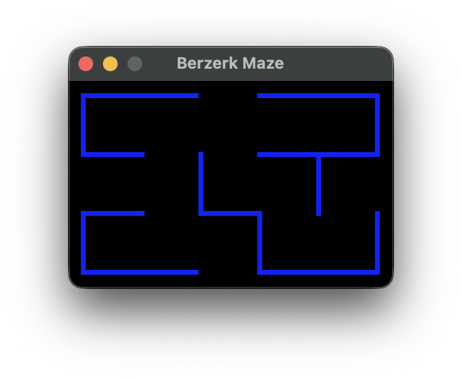

# BerzerkMaze

A small maze generator/renderer inspired by the BERZERK room-generation algorithm.



## Features

- Deterministic room generation based on BERZERK by Dan Hitchens - (c) 1982 Atari, Inc
- Real-time rendering through MonoGame.
- Keyboard navigation between rooms.

## Tech Stack

- .NET 10 (`net10.0`)
- MonoGame `DesktopGL` (`MonoGame.Framework.DesktopGL`)

## Build

From the repository root:

```bash
dotnet build BerzerkMaze.sln
```

## Run

```bash
dotnet run --project /Users/rui/src/pg/berzerkmaze/BerzerkMaze/BerzerkMaze.csproj
```

## Controls

- `Up Arrow`: move to room above
- `Down Arrow`: move to room below
- `Left Arrow`: move to room on the left
- `Right Arrow`: move to room on the right
- `Esc`: exit
